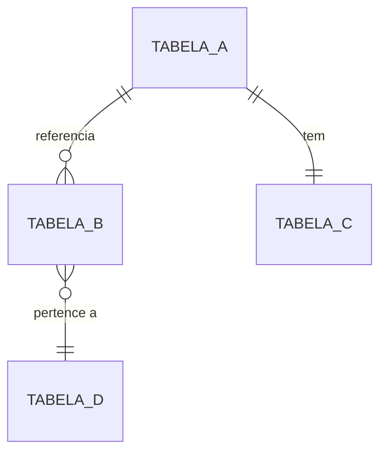
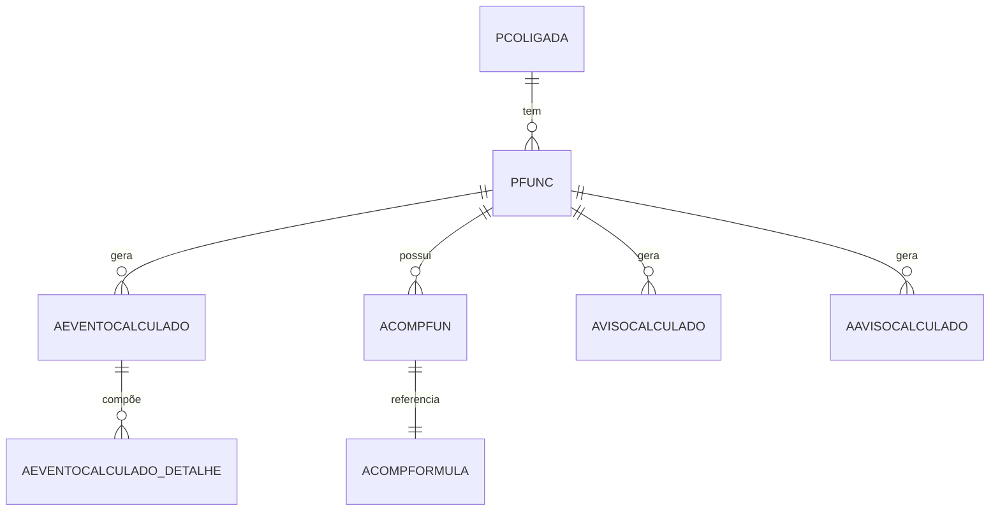
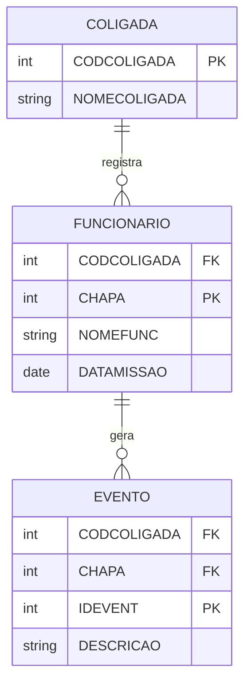

# Diagrama de Relacionamento de Tabelas

## Quando usar
- Visualizar a estrutura de relacionamentos entre tabelas
- Documentar fluxos de dados para um conjunto de tabelas
- Entender dependências e impacto de chaves estrangeiras
- Mapear tabelas relacionadas a um domínio específico

## Pré-requisitos
- Identificar as tabelas envolvidas
- Ter acesso à documentação das FK em `docs/db/tables/<TABELA>.md`
- Conhecer a direção dos relacionamentos

## Padrão de Diagrama Mermaid

### 1. Estrutura Básica

### 2. Símbolos de Cardinalidade
| Símbolo | Significado |
|---------|------------|
| `\|\|` | Um para Um (1:1) |
| `o\|` | Zero ou Um (0:1) |
| `\|\{` | Um para Muitos (1:N) |
| `o{` | Zero ou Muitos (0:N) |

### 3. Construir Diagrama a partir de Documentação
1. Ler `docs/db/tables/<TABELA>.md`
2. Identificar seção "Chaves Estrangeiras"
3. Mapear relacionamentos de entrada e saída
4. Desenhar com Mermaid

## Exemplo Prático

Para tabelas de folha de pagamento e recursos humanos:

### Estrutura Detalhada com Atributos

## Dicas de Visualização
- **Agrupar por módulo**: Tabelas com mesmo prefixo (P, A, G, etc.)
- **Direcionar fluxo**: Colocar tabelas pai acima, filhas abaixo
- **Código de cores**: Usar comentários para destacar críticos
- **Simplificar**: Mostrar apenas relacionamentos principais em primeiro nível
- **Detalhar progressivamente**: Criar diagramas para cada subdomínio

## Exportar Diagrama
Mermaid pode ser exportado para:
- PNG/SVG: Via VS Code preview
- URL: Usar [Mermaid Live Editor](https://mermaid.live)
- Markdown: Incluir fenced code block com \`\`\`mermaid
